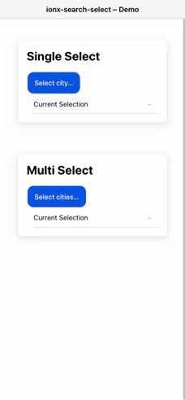

# IonxSearchSelect

A modern **Search & Select component** for Angular + Ionic.  
Built with **Standalone Components**, **Angular Signals**, and full **CVA (ControlValueAccessor)** support.

<p align="center">
  
  
  
  
</p>

<p align="center">
  
</p>

## ✨ Features

- 🔎 Searchable select with keyboard navigation
- 🌀 Works with **Reactive Forms** and **Template-driven Forms**
- 🧩 Can be used standalone without Angular Forms
- 🌍 Built-in i18n (EN/DE) with overrides
- 🎨 Ionic design, ships as Angular standalone library
- ♻️ No RxJS required (pure Signals API)

## 📦 Installation

This library requires **@ionic/angular** and **ionicons** as peer dependencies.

Install them step by step:

```bash
npm install @ionic/angular ionicons
```

Then install the library:

```bash
npm install ionx-search-select
```

Peer dependencies:

- Angular ≥ 20
- Ionic ≥ 8

## 🚀 Usage

### 1. Reactive Forms (`FormControl`)

```ts
// demo.page.ts
import { FormControl } from '@angular/forms';
import { SelectOption } from 'ionx-search-select';

type Id = string;

@Component({
  /* ... */
})
export class DemoPage {
  city = new FormControl<Id | null>(null);

  cityOptions: SelectOption<Id>[] = [
    { value: 'ber', label: 'Berlin' },
    { value: 'ham', label: 'Hamburg' },
    { value: 'muc', label: 'Munich' },
    { value: 'cgn', label: 'Cologne', disabled: true },
    { value: 'fra', label: 'Frankfurt' },
  ];
}
```

```html
<ionx-search-select [options]="cityOptions" placeholder="Choose a city…" [formControl]="city">
</ionx-search-select>

<p>Selected: {{ city.value }}</p>
```

### 2. Template-driven Forms (`[(ngModel)]`)

```ts
// demo.page.ts
selectedCity: string | null = null;

cityOptions: SelectOption<string>[] = [
  { value: 'ber', label: 'Berlin' },
  { value: 'ham', label: 'Hamburg' },
  { value: 'muc', label: 'Munich' },
  { value: 'fra', label: 'Frankfurt' },
];
```

```html
<ionx-search-select [options]="cityOptions" placeholder="Choose a city…" [(ngModel)]="selectedCity">
</ionx-search-select>

<p>Selected: {{ selectedCity }}</p>
```

### 3. Standalone (without Angular Forms)

```ts
// demo.page.ts
selectedCity: string | null = null;

cityOptions: SelectOption<string>[] = [
  { value: 'ber', label: 'Berlin' },
  { value: 'ham', label: 'Hamburg' },
  { value: 'muc', label: 'Munich' },
];
```

```html
<ionx-search-select
  [options]="cityOptions"
  [value]="selectedCity"
  (changed)="selectedCity = $event"
>
</ionx-search-select>

<p>Selected: {{ selectedCity }}</p>
```

## ⚙️ Inputs

| Input               | Type                               | Default        | Description                      |
| ------------------- | ---------------------------------- | -------------- | -------------------------------- |
| `options`           | `SelectOption<T>[]`                | `[]`           | Options to display               |
| `placeholder`       | `string`                           | `Select…`      | Trigger label & modal title      |
| `multiple`          | `boolean`                          | `false`        | Enable multi select              |
| `clearable`         | `boolean`                          | `true`         | Show **Clear** button            |
| `closeOnSelect`     | `boolean`                          | `true`         | Auto close after select (single) |
| `locale`            | `'en' \| 'de'`                     | `'en'`         | Built-in i18n                    |
| `i18n`              | `Partial<IonxSearchSelectI18n>`    | `{}`           | Override any text                |
| `searchPlaceholder` | `string \| null`                   | `null`         | Explicit search placeholder      |
| `displayWith`       | `(opt: SelectOption<T>) => string` | `o => o.label` | Custom label renderer            |
| `compareWith`       | `(a: T, b: T) => boolean`          | `a===b`        | Custom equality fn               |
| `trackBy`           | `(o: SelectOption<T>) => unknown`  | `o.value`      | TrackBy fn                       |

## 📤 Outputs

| Output         | Payload            | Description            |
| -------------- | ------------------ | ---------------------- |
| `changed`      | `T \| T[] \| null` | Value changed          |
| `openedChange` | `boolean`          | Modal open/close state |
| `opened`       | `void`             | Modal opened           |
| `closed`       | `void`             | Modal closed           |
| `cleared`      | `void`             | Clear clicked          |

## 🔑 Interfaces

```ts
export interface SelectOption<T = unknown> {
  value: T;
  label: string;
  disabled?: boolean;
}

export type IonxSearchSelectI18n = {
  clear: string;
  done: string;
  selected: string;
  noResults: string;
  search: string;
  searchAriaLabel: string;
  closeAriaLabel: string;
};
```

## 🛠️ Development

Build the library:

```bash
ng build ionx-search-select
```

Run the demo app:

```bash
ng serve demo
```

Run unit tests:

```bash
ng test
```

## 📄 License

MIT – free to use, modify and distribute.
